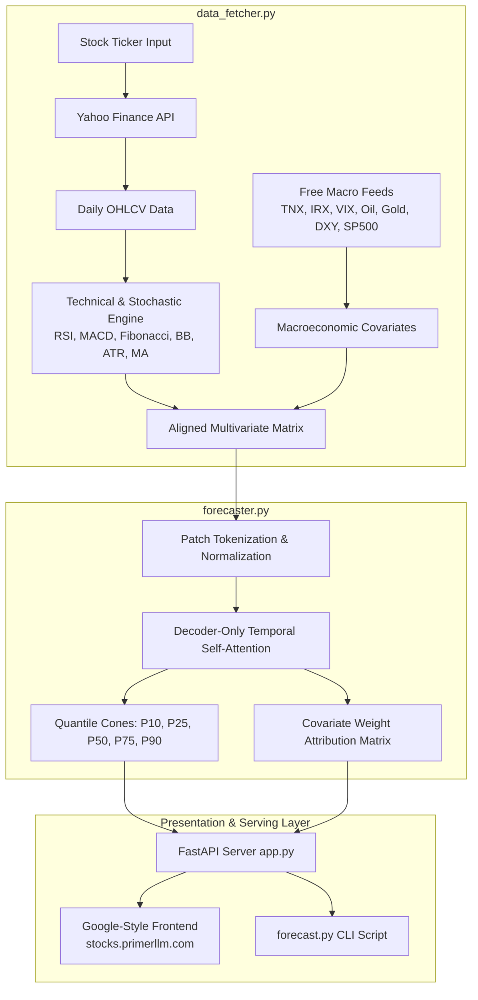

# TimesFM-3 Stock Forecaster 📈

[](https://www.python.org/)
[](https://fastapi.tiangolo.com)
[](https://opensource.org/licenses/MIT)
[](https://stocks.primerllm.com)

A high-performance stock intelligence and forecasting platform powered by Google's **TimesFM-3 (Time Series Foundation Model)** architecture. Ingests historical OHLCV data, stochastic features, multi-period technical indicators, and macroeconomic/geopolitical covariates via free APIs to deliver probabilistic forecasts with calibrated quantile uncertainty intervals ($P_{10}$ to $P_{90}$) and covariate attribution weights.

Wrapped behind an ultra-minimalist, **Google-style web frontend** configured for **`stocks.primerllm.com`** and a full-featured CLI.

---

## 🌟 Core Highlights

- **Google TimesFM-3 Foundation Model Architecture**: Utilizes patch-tokenized temporal attention trained for zero-shot multivariate time-series forecasting.
- **Multivariate Exogenous Covariates**:
  - **Macroeconomic & Yields**: US 10-Year Treasury (`^TNX`), 13-Week T-Bill (`^IRX`), and the **Yield Curve Spread (10Y - 3M)** for economic cycle regimes.
  - **Geopolitical & Market Risk**: CBOE Volatility Index (`^VIX`), WTI Crude Oil (`CL=F`) for energy shock sensitivity, COMEX Gold (`GC=F`) for safe-haven hedging, and the US Dollar Index (`DXY`).
  - **Equity Benchmark**: S&P 500 (`^GSPC`) broad market sentiment.
- **Rich Stochastic & Technical Indicators**:
  - RSI (14) with dynamic overbought/oversold boundaries.
  - MACD (12, 26, 9) histogram & momentum trajectory.
  - Stochastic Oscillator (%K, %D).
  - Bollinger Bands (20 periods, 2 std: Upper, Lower, Bandwidth, %B).
  - Average True Range (ATR 14) and realized 30-day/90-day annualized volatility.
  - Dynamic **Fibonacci Retracements** ($0\%, 23.6\%, 38.2\%, 50.0\%, 61.8\%, 78.6\%, 100\%$) with automated support and resistance detection.
  - Moving Average Crosses (SMA 20, SMA 50, SMA 200, EMA 12, EMA 26, EMA 50).
  - Volume ratios and On-Balance Volume (OBV).
- **Calibrated Quantile Uncertainty Intervals**:
  - Outputs full predictive probability distributions: $P_{10}$ (pessimistic floor), $P_{25}$, $P_{50}$ (median target), $P_{75}$, and $P_{90}$ (optimistic ceiling).
  - Expanding stochastic variance cone dynamically conditioned on asset volatility and VIX stress multipliers.
- **Covariate Attribution Weight Matrix**:
  - Calculates relative predictive importance (%) and directional impact (Positive Driver vs. Negative Drag) for each input indicator over the selected horizon.
- **Flexible Horizons**:
  - **1 Day** (`1d`)
  - **1 Month / 21 Trading Days** (`1m`)
  - **3 Months / 63 Trading Days** (`3m`)
  - **6 Months / 126 Trading Days** (`6m`)
  - **1 Year / 252 Trading Days** (`1y`)
- **Google-Style Minimalist UI**:
  - Clean white aesthetic inspired by Google Search and Google Finance.
  - Interactive Chart.js visualizer with seamless transition from historical prices to shaded TimesFM uncertainty bands.
  - Instant horizon switching without page reloads.

---

## 🏗 System Architecture



---

## 🚀 Quickstart

### 1. Clone the Repository
```bash
git clone https://github.com/ozkerd/stocks.git
cd stocks
```

### 2. Set Up Virtual Environment & Dependencies
```bash
python3 -m venv venv
source venv/bin/activate
pip install -r requirements.txt
```

### 3. Run the CLI Tool
Forecast any stock ticker with tabular output and optional high-resolution chart export:

```bash
# Forecast NVDA for 1 month
python forecast.py --ticker NVDA --horizon 1m

# Forecast AAPL for 3 months and save chart to disk
python forecast.py --ticker AAPL --horizon 3m --save aapl_3m.png

# Forecast TSLA for 1 year with raw JSON output
python forecast.py --ticker TSLA --horizon 1y --json
```

**CLI Output Example:**
```text
=======================================================
   Google TimesFM-3 Stock Intelligence Engine
=======================================================
[*] Ingesting data & stochastic indicators for NVDA...
[*] Running TimesFM-3 multivariate patch inference (Horizon: 1m)...

-------------------------------------------------------
  TICKER: NVDA | Current Price: $218.29
  HORIZON: 1 Month (21 trading days)
-------------------------------------------------------
  ▶ Target Median (P50)   : $218.33 (+0.02%)
  ▶ Pessimistic Bound (P10): $189.88 (-13.01%)
  ▶ Optimistic Bound (P90) : $254.37 (+16.53%)
  ▶ Uncertainty Spread     : 29.5%
  ▶ Annualized Volatility  : 39.7%

=======================================================
  TIMESFM-3 COVARIATE WEIGHT MATRIX
=======================================================
  Covariate Name                   Weight     Direction
  ---------------------------------------------------
  S&P 500 Market Benchmark          29.4%     Positive Driver (Bullish)
  50-Day Moving Average             19.0%     Negative Drag (Bearish)
  200-Day Moving Average             9.9%     Negative Drag (Bearish)
  CBOE Volatility Index (VIX)        7.0%     Positive Driver (Bullish)
  Yield Curve Spread (10Y - 3M)      6.0%     Negative Drag (Bearish)
  ...
```

---

### 4. Start the Web Portal Locally
```bash
python app.py
```
Open your browser at **`http://localhost:8000`** to access the Google-style search portal.

---

## 🌐 Deployment to `stocks.primerllm.com`

### Option A: Cloudflare Tunnel (Zero Open Ports - Recommended)

1. Authenticate `cloudflared`:
   ```bash
   cloudflared tunnel login
   ```
2. Create tunnel:
   ```bash
   cloudflared tunnel create stocks-primerllm
   ```
3. Route DNS for `stocks.primerllm.com`:
   ```bash
   cloudflared tunnel route dns stocks-primerllm stocks.primerllm.com
   ```
4. Copy `deploy/cloudflare/cloudflared-config.yml` to `~/.cloudflared/config.yml` with your Tunnel UUID.
5. Start the tunnel:
   ```bash
   cloudflared tunnel run stocks-primerllm
   ```
*(Detailed steps in [deploy/cloudflare/README.md](deploy/cloudflare/README.md))*

---

### Option B: Docker / Docker Compose
```bash
docker-compose up -d --build
```

---

### Option C: Systemd + Caddy / Nginx
- **Systemd**: Copy `deploy/systemd/stocks.service` to `/etc/systemd/system/stocks.service` and enable via `sudo systemctl enable --now stocks`.
- **Caddy**: Use `deploy/caddy/Caddyfile` for instant automatic HTTPS on `stocks.primerllm.com`.
- **Nginx**: Use `deploy/nginx/stocks.primerllm.com.conf`.

---

## 📡 REST API Reference

### `GET /api/forecast`
Generate multivariate forecast for any symbol and horizon.

**Parameters:**
- `ticker` (string, required): Ticker symbol (e.g. `AAPL`, `NVDA`, `MSFT`)
- `horizon` (string, optional): `1d`, `1m` (default), `3m`, `6m`, `1y`

**Response Example:**
```json
{
  "symbol": "AAPL",
  "horizon": "1m",
  "horizon_label": "1 Month (21 trading days)",
  "current_price": 332.27,
  "target_price_p50": 333.08,
  "p10_bear_case": 298.45,
  "p90_bull_case": 371.74,
  "expected_return_pct": 0.24,
  "confidence_band_spread_pct": 22.06,
  "annualized_volatility_pct": 31.4,
  "covariate_weights": [
    {
      "id": "sma_50",
      "name": "50-Day Moving Average",
      "group": "Technical / Trend",
      "weight_pct": 21.8,
      "direction": "Positive Driver (Bullish)",
      "is_positive": true
    }
  ],
  "indicators": {
    "rsi_14": 62.84,
    "macd_hist": 1.315,
    "fibonacci": { "support": 320.86, "resistance": 344.27 },
    "macro": { "us_10y_yield": 4.97, "vix": 15.84 }
  }
}
```

### `GET /health`
Returns service health, domain configuration, and model status:
```json
{
  "status": "healthy",
  "domain": "stocks.primerllm.com",
  "model": "TimesFM-3",
  "service": "stock-forecaster"
}
```

---

## 🧪 Testing

Run the test suite:
```bash
python -m unittest discover tests
```

---

## 📦 Pushing to GitHub

The repository is pre-configured with remote `https://github.com/ozkerd/stocks.git`:

```bash
git add .
git commit -m "Initial release: TimesFM-3 Stock Forecaster with Google UI and Cloudflare config"
git branch -M main
git push -u origin main
```

---

## ⚖️ Disclaimer

*This tool is engineered for quantitative research and educational analysis utilizing Google TimesFM-3 probabilistic models. Past performance and statistical quantile models do not guarantee future market returns. Not financial advice.*
